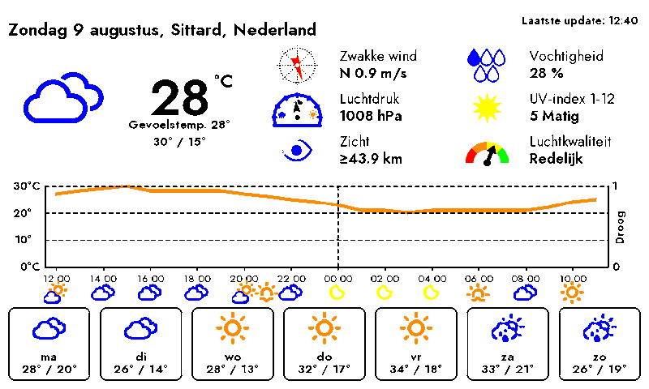

# InkyPiZero



## About

A weather-only E-Ink display, built for a Raspberry Pi driving a Pimoroni Inky
Impression panel. It renders natively with Pillow (no browser, no Chromium)
and runs as a lightweight, periodic job instead of a long-running web app -
just fetch the forecast, draw it, push it to the display, repeat.

This project started as a fork of [fatihak/InkyPi](https://github.com/fatihak/InkyPi),
a full multi-plugin E-Ink dashboard with a web UI, then split off into its own
repo once it no longer shared any code with that app - just the weather
plugin's logic, ported and stripped down to a single purpose: a minimal,
low-overhead weather display suitable for weaker hardware (e.g. a Raspberry
Pi Zero W) that can't comfortably run a headless browser.

**Features**:
- Current conditions, an hourly temperature/rain chart, and a multi-day
  forecast, all hand-drawn with Pillow. Each forecast card shows the
  expected rain amount next to the icon on wet days; a weather-quality
  classification (how pleasant a day is - temperature + rain combined,
  ranges/colors editable in `weather_quality.toml`) is computed every
  render but not currently drawn anywhere - see
  [settings.md](./docs/settings.md)
- "Kwaliteit & Pollen" detail combines air quality (RIVM's official Dutch
  LKI index) and pollen (hay fever/Hooikoorts, for European locations in
  season) into one reading - shows the worse of the two on a combined
  Goed/Matig/Onvoldoende/Slecht/Zeer slecht scale - see
  [settings.md](./docs/settings.md)
- No plugins, no playlist scheduling - the *rendering* is a periodic
  `systemd` timer job (e.g. every 10 minutes), not a persistent service.
  The physical panel itself only actually refreshes when the current
  icon/temperature changes (or at least once an hour regardless) - not
  every single tick, sparing the display unnecessary wear/flash - see
  [settings.md](./docs/settings.md)
- A small always-on web UI (settings, WiFi management, shutdown) runs
  independently of that render timer - see [settings.md](./docs/settings.md)
- If it can't reach a known WiFi network, the device hosts its own setup AP
  and shows the connect details directly on the e-paper display - see
  [networking.md](./docs/networking.md)
- Weather, UV, and pollen data from [Open-Meteo](https://open-meteo.com/);
  air quality (for "Kwaliteit & Pollen", above) from
  [RIVM/luchtmeetnet.nl](https://www.luchtmeetnet.nl/) - neither needs an
  API key
- Press button A on the back of the Inky Impression to blank the screen and
  safely shut the Pi down (also available from the web UI)

## Hardware

- Raspberry Pi (Zero W, Zero 2 W, 3, or 4)
- MicroSD Card (min 8 GB) like [this one](https://amzn.to/3G3Tq9W)
- E-Ink Display: Inky Impression by Pimoroni
    - **[13.3 Inch Display](https://collabs.shop/q2jmza)**
    - **[7.3 Inch Display](https://collabs.shop/q2jmza)**
    - **[5.7 Inch Display](https://collabs.shop/ns6m6m)**
    - **[4 Inch Display](https://collabs.shop/cpwtbh)**
- Picture Frame or 3D Stand

**Disclosure:** The links above are affiliate links (carried over from the
upstream project this was forked from).

## Installation

1. Flash Raspberry Pi OS onto your SD card - see
   [installation.md](./docs/installation.md) for detailed steps.
2. Clone the repository and run the installer:
    ```bash
    git clone git@github.com:DorusvdLinden/InkyPiZero.git
    cd InkyPiZero
    sudo bash install/install.sh
    ```
3. **Set your location**: either edit `config.py` directly
   (`latitude`/`longitude`) before installing, or set it afterward from the
   web UI at `http://<device IP>:8080/settings` - see
   [settings.md](./docs/settings.md) for every option and how the two
   relate.
4. Reboot if the installer enabled SPI for the first time.
5. **First-time WiFi**: if the device can't reach a network you've already
   set up (e.g. Raspberry Pi Imager), it hosts its own setup AP and shows
   the connect details on the e-paper display - see
   [networking.md](./docs/networking.md).

The installer sets up its own minimal Python virtual environment and a
`pi-weather-display.timer` systemd unit that checks for fresh weather data
every 10 minutes - the physical panel itself only actually refreshes when
the current icon/temperature changes, or at least once an hour regardless
(see [settings.md](./docs/settings.md)).

Useful commands after installing:

```bash
systemctl status pi-weather-display.timer     # confirm the timer is active
journalctl -u pi-weather-display.service      # view render logs
sudo systemctl start pi-weather-display.service  # force an immediate render
systemctl status pi-weather-buttons.service   # confirm the button listener is active
systemctl status pi-weather-web.service       # confirm the web UI is active
```

To update: `git pull` then rerun `sudo bash install/install.sh` (safe to
rerun - reinstalls the venv dependencies and refreshes the systemd units in
place).

To uninstall: `sudo bash install/uninstall.sh` (removes the systemd
service/timer and its virtual environment; your git checkout and
`config.py` are left untouched).

See [development.md](./docs/development.md) for local (no-hardware) testing.

## Architecture

- `weather_data.py` - fetches and parses Open-Meteo data (current, hourly,
  daily forecast, UV, pollen) plus RIVM/luchtmeetnet.nl air quality (LKI)
  into typed dataclasses
- `weather_quality.toml` - user-editable ranges/colors for a forecast-card
  weather-quality classification (temperature/precipitation -> tier ->
  color) - re-read fresh every render, no restart needed to take effect;
  computed but not currently drawn anywhere (see `docs/settings.md`)
- `layout.py` - fixed pixel regions for the 800x480 canvas
- `canvas.py` - orchestrates one full render (`WeatherCanvas.render()`)
- `widgets/` - gauge (wind/pressure/UV/AQI - AQI's gauge doubles as the
  combined "Kwaliteit & Pollen" icon), chart (temp/rain), forecast-card,
  and icon/humidity-drop drawing - all hand-drawn with Pillow
- `display/inky_driver.py` - thin wrapper around the `inky` library;
  `display/mock_driver.py` saves to a file instead, for testing without
  hardware
- `assets/` - the icon PNGs and font files it actually uses (Bitter,
  Jost - selectable via `config.font_family`/the web UI; Noto Sans JP as
  an automatic per-character fallback for glyphs neither of those cover,
  see [attribution.md](./docs/attribution.md))
- `config.py` - a plain dataclass (location, screen mode, etc.) of
  hard-coded defaults; `settings_store.py` overlays a saved
  `settings.json` on top of it (written by the web UI) - see
  [settings.md](./docs/settings.md) for every option
- `main.py` - fetch -> render -> display, no scheduling loop of its own
  (that's the systemd timer's job); on real hardware, only actually pushes
  to the panel if the current icon/temperature changed or an hour has
  passed since the last refresh (`display_freshness.py`) - `--mock-output`
  always renders
- `button_listener.py` - listens for the physical buttons: A (GPIO5) blanks
  the screen + powers off, B/C/D (GPIO6/16/24) switch the active screen
  layout (`display_mode.py`) and trigger an immediate re-render; unlike
  `main.py` this runs as its own persistent `pi-weather-buttons.service`,
  since a button press can happen anytime
- `display_mode.py` - persists which screen layout (B/C/D button choice) is
  currently selected, since `main.py` is a one-shot timer job with no
  memory between renders
- `display_freshness.py` - decides whether a timer tick should actually
  refresh the physical display (see [settings.md](./docs/settings.md)) -
  same one-shot-job persistence pattern as `display_mode.py`
- `web_app.py` + `web/` - a small always-on Flask service
  (`pi-weather-web.service`) for settings/WiFi management/shutdown,
  completely independent of the render timer - see
  [settings.md](./docs/settings.md)
- `wifi_manager.py` - WiFi provisioning: hosts a setup AP (via hostapd, not
  NetworkManager's own hotspot mode - see [networking.md](./docs/networking.md))
  when no known network is reachable, and manages saved network credentials
  the rest of the time via `nmcli`
- `setup_screen.py` - renders the setup AP's SSID/password/URL directly to
  the e-paper display, since that's the one channel guaranteed available
  regardless of network state
- `TODO.md` - known bugs and rough edges

Chosen over an ESP32-S3/embedded-C rewrite because it reuses Pimoroni's
existing `inky` Python display driver unchanged, and reuses the weather
data-fetch/parsing logic almost verbatim, rather than reimplementing the
whole visual layout in C.

## Documentation

- [settings.md](./docs/settings.md) - every option/setting: physical
  buttons, the web UI, `config.py`, and CLI flags
- [networking.md](./docs/networking.md) - WiFi provisioning/setup-AP design
  and the NetworkManager/hostapd decisions behind it
- [icons.md](./docs/icons.md) - the full icon catalog, with images
- [changes.md](./docs/changes.md) - numbered log of the project's larger
  changes, each tagged active/outdated/rejected
- [development.md](./docs/development.md) - local (no-hardware) development
- [manual_test_checklist.md](./manual_test_checklist.md) - human
  checklist for what the automated test suite can't cover (physical
  buttons, real e-paper appearance, WiFi AP behavior, QR scanning)
- [installation.md](./docs/installation.md) - detailed Raspberry Pi OS
  flashing steps
- [troubleshooting.md](./docs/troubleshooting.md) - common issues and fixes
- [attribution.md](./docs/attribution.md) - font/icon licensing
- [TODO.md](./TODO.md) - known bugs and rough edges

## License

Distributed under the GPL 3.0 License, see [LICENSE](./LICENSE) for more
information.

This project includes fonts and icons with separate licensing and
attribution requirements. See [Attribution](./docs/attribution.md) for
details.

## Issues

Check out the [troubleshooting guide](./docs/troubleshooting.md).

If you're using a Pi Zero W, note that there are known issues during
installation - see
[Known Issues during Pi Zero W Installation](./docs/troubleshooting.md#known-issues-during-pi-zero-w-installation)
in the troubleshooting guide.

## Acknowledgements

This project is a fork of [InkyPi](https://github.com/fatihak/InkyPi) by
[fatihak](https://github.com/fatihak) - all credit for the original
multi-plugin app, web UI, and display driver integration goes there. Also
worth checking out:

- [PaperPi](https://github.com/txoof/PaperPi) - supports Waveshare devices
- [InkyCal](https://github.com/aceinnolab/Inkycal) - modular plugins for custom dashboards
- [PiInk](https://github.com/tlstommy/PiInk) - inspiration behind InkyPi's original Flask web UI
- [rpi_weather_display](https://github.com/sjnims/rpi_weather_display) - alternative eink weather dashboard with advanced power efficiency
