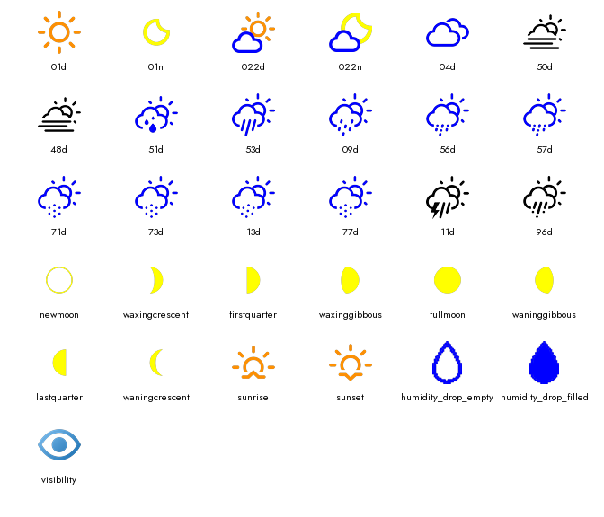

# Icon Catalog

Reference for every icon currently shipped and where/how large it's drawn.
Keep this up to date whenever an icon is added, resized, or a call site
changes - see the standing rule in [CLAUDE.md](../CLAUDE.md).

All icons are pre-rendered **PNGs** (RGBA, transparent background) in
`assets/icons/`, loaded at runtime by `widgets/icons.py`'s `AssetStore` - no
SVG/resvg rasterization happens in the running app. SVGs only exist in a
separate, not-committed clone of `erikflowers/weather-icons`, used solely by
the dev-time generator `scripts/generate_icons.py`.

*Generated by `python scripts/icon_overview.py` - rerun and re-commit
`docs/images/icon_overview.png` whenever an icon is added, removed, or
recolored.*

## Source assets (31 files, `assets/icons/`)

| File(s) | Category |
|---|---|
| `01d.png` / `01n.png` | Clear sky (day/night) - `01n` gets extra generation-time thickening, see below |
| `022d.png` / `022n.png` | "Half cloudy" composite (day/night) - hand-built, see below |
| `04d.png` | Overcast |
| `50d.png`, `48d.png` | Fog |
| `51d.png` | Drizzle/sprinkle |
| `53d.png` | Rain |
| `09d.png` | Showers |
| `56d.png`, `57d.png` | Sleet |
| `71d.png`, `73d.png` | Snow |
| `13d.png` | Heavy snow + wind |
| `77d.png` | Snow grains |
| `11d.png` | Thunderstorm |
| `96d.png` | Thunderstorm with hail (WMO 96/99) - `wi-day-hail`, `storm` color, no night variant (matches `11d`, which also has none) |
| `newmoon.png`, `waxingcrescent.png`, `firstquarter.png`, `waxinggibbous.png`, `fullmoon.png`, `waninggibbous.png`, `lastquarter.png`, `waningcrescent.png` | 8 moon phases |
| `sunrise.png`, `sunset.png` | Sun-event markers on the chart |
| `humidity_drop_filled.png`, `humidity_drop_empty.png` | Humidity gauge droplets - hand-cropped from an old screenshot, not weather-icons-sourced |
| `visibility.png` | Visibility data-point icon |

Naming: weather-condition icons use a WMO-flavored key + `d`/`n` day/night
suffix (`01d`/`01n`); moon phases and sun events use plain lowercase names;
the humidity droplets and `visibility` are one-off names outside the `d`/`n`
scheme.

## Weather-code → icon key (`weather_data.map_weather_code_to_icon`)

| WMO weather code(s) | Icon key (day) |
|---|---|
| 0 | `01d` |
| 1, 2 | `022d` |
| 3 | `04d` |
| 51, 61, 80 | `51d` |
| 53, 63, 81 | `53d` |
| 55, 65, 82 | `09d` |
| 45 | `50d` |
| 48 | `48d` |
| 56, 66 | `56d` |
| 57, 67 | `57d` |
| 71, 85 | `71d` |
| 73 | `73d` |
| 75, 86 | `13d` |
| 77 | `77d` |
| 95 | `11d` |
| 96, 99 | `96d` |
| (no match) | `01d` |

**Night remap** (`is_day == 0`): only `{"01d": "01n", "022d": "022n", "10d": "10n"}` -
every other key is used unchanged at night (there are no other `*n` PNGs).
Daily forecast-card icons always call this with `is_day=1` - forecast cards
never show a night variant, regardless of what day they're for.

## The `022d`/`022n` composite (`scripts/generate_icons.py`)

The source weather-icons "half cloudy" SVG packs sun+cloud into one `<path>`,
so CSS/fill-based recoloring can't color the cloud separately from the sun -
these two icons are instead hand-composited from two separately-rendered,
separately-colored layers, built by `_composite_icon()`:

1. **Back layer** (sun for `022d` / moon for `022n`): rendered directly at
   its final pixel size via resvg (not rendered-then-PIL-downscaled - an
   extra resize pass was blurring the ring before `AssetStore`'s own resize
   got to it). Stays hollow, then thickened with a *full* 1px dilation
   (`thicken_icon(..., strength=1.0)`, stronger than the runtime default) to
   fight dithering speckle on the ring's antialiased edge.
2. **Front layer** (`wi-cloud`): same direct-size rendering + full-strength
   thickening (fixes dithered gaps in the cloud's bottom line), then
   **solid-filled** via a 4-corner flood fill (`_solid_fill`/`_solid_silhouette`)
   so the hollow cloud outline becomes a solid shape (`PALETTE.cloud_interior`,
   i.e. white) that actually occludes the sun/moon behind it - composited as
   solid interior + thickened outline stroke on top.
3. Layers paste at fixed offsets (`(40, 0)` back / `(0, 70)` front for
   `022d`; `(5, -30)` back / `(0, 70)` front for `022n`) on a 300x300 canvas.

Everything else in `assets/icons/` is a plain single-color render (one
weather-icons SVG + one flat `PALETTE` color, no compositing), except
`01n` (`wi-night-clear`), which also gets a generation-time
`thicken_icon(..., strength=1.0)` pass (`EXTRA_THICKEN` in
`generate_icons.py`) - its crescent read noticeably thin/pale (an
antialiased-edge-heavy hollow outline that dithers poorly) compared to
other icons. Full strength, not a partial blend, matching the `022d`/`022n`
composite above: a pixel-level check of the fraction of semi-transparent
"ambiguous" edge pixels at each candidate strength found every partial
value (0.25-0.75) roughly *doubles* that fraction relative to either
endpoint - `thicken_icon`'s `MaxFilter` blend bakes in its own soft edge on
top of the original antialiasing. Only a full 1px dilation is both bolder
and cleaner.

**This fixes the thin/pale-edge problem, not a silhouette match to
`wi-moon-*`.** `01n` is a hollow ring outline; most `wi-moon-*` phase icons
are solid-filled shapes - a different SVG topology no amount of stroke
thickening closes. A matched-size/matched-treatment side-by-side still
shows `01n` reading as a denser ring next to the phase icons' cleaner
disc/crescent silhouettes. `_solid_fill()` (the same helper the `022d`/
`022n` composite's cloud layer uses) was tried and rejected as a fix for
*that* specifically - it turns `01n`'s hollow ring into a near-full disc
with a notch, further from "crescent", not closer. Left open; would need a
different source SVG (see [Known gaps](#known-gaps)) or a custom glyph, not
a `thicken_icon()` tweak.

### Regenerating icons

Not run automatically - only needed after changing a color or picking a
different source icon:

1. `git clone https://github.com/erikflowers/weather-icons.git` next to this
   repo (or edit `SVG_DIR` in `scripts/generate_icons.py` to point wherever
   you cloned it)
2. `pip install resvg-py` (dev-only tool, not an app dependency - pure-Rust
   SVG renderer, no system Cairo needed, unlike `cairosvg` which doesn't
   work out of the box on Windows)
3. `python scripts/generate_icons.py`
4. Regenerate the gallery image at the top of this doc too:
   `python scripts/icon_overview.py`, then copy
   `mock_display_output/icon_overviews/full_icon_set_white_bg.png` over
   `docs/images/icon_overview.png` and commit it.

## `AssetStore.icon(key, size)` (`widgets/icons.py`)

- Two-level cache (base cropped image per `key`; final resized image per
  `(key, size)`), populated lazily, kept for the process lifetime.
- Loads `{icon_dir}/{key}.png`, crops to `getbbox()` (source PNGs carry
  inconsistent transparent padding - cropping first makes a uniform resize
  produce consistent-looking icons).
- Moon glyphs (`MOON_ICON_KEYS` - `01n` + all 8 phase names, **not** `022n`)
  get padded onto a larger transparent canvas first (`MOON_FILL_FRACTION =
  0.625`) since their tighter/more-square bbox would otherwise scale up
  larger than sun/cloud icons at the same box size.
- Resize is aspect-preserving fit-to-box (`Image.LANCZOS`), letterboxed onto
  a transparent canvas of exactly the requested `size`.

## `thicken_icon(icon, amount=1, strength=0.5)` (`widgets/icons.py`)

Dilates the icon's **alpha channel only** (a ring stays a ring, just
bolder) so thin strokes read less speckled once quantized to the panel's
7-color palette. Multi-color aware: each distinct near-opaque color gets its
own alpha mask dilated independently via `ImageFilter.MaxFilter`, then
re-composited - needed so the two-tone `022d`/`022n` composites don't get
flattened to one sampled color. `strength=0.5` blends half-way between
original and a full 1px dilation (`MaxFilter` only supports whole-pixel
steps).

## Every runtime call site, with exact size

| Where | What | Size expression | Typical value | Thickened? |
|---|---|---|---|---|
| `canvas.py:77-82` | Current-conditions large icon | `int(region.h * 0.62)`, `region = layout.CURRENT_TEMPERATURE` (`h=165`) | `(102, 102)` | No |
| `canvas.py:179-184` | Visibility data-point icon | `int(box.w * 0.55)`, `int(box.h * 0.55)` - `box` varies by screen mode/grid | original 2x3 grid: `(50, 30)`; compact `icon_left` 2x2: `(41, 45)` | No |
| `widgets/chart.py:212-216` (`ICON_SIZE = 30`) | Hourly icon strip (every `graph_icon_step` hours) + sunrise/sunset markers | fixed constant | `(30, 30)` | **Yes** (default strength) |
| `widgets/forecast.py:14-20` | Daily forecast-card icon | `int(min(region.w * 0.85, region.h * 0.45))`, `region.h = FORECAST_ROW.h = 95` | `~(42, 42)` at `forecast_days=7` (height-bound) | **Yes** (default strength) |
| `widgets/forecast.py:27-33` | Moon-phase icon on forecast card (`show_moon_phase` only) | fixed constant | `(14, 14)` | **Yes** (default strength) |
| `widgets/icons.py:139-140` (`draw_humidity_drops`) | 5 humidity droplets (3-over-2) | `drop_h = int(region.h * 0.42)`, `drop_w = int(drop_h * 28/38)` | original grid (`h=55`): `(16, 23)` per drop | No |

`widgets/gauge.py` draws the wind compass, pressure gauge, UV sunburst, and
AQI band entirely with PIL primitives - none of them load a raster icon.
The AQI band/needle (`render_aqi_gauge`) is also the icon for the combined
"Kwaliteit & Pollen" data point (see `docs/settings.md`) - no separate
pollen icon exists; a procedurally-drawn flower icon was tried and then
removed when pollen was merged into the AQI data point rather than kept as
its own cell (see `docs/changes.md` entry 22).

`scripts/icon_overview.py` also calls `assets.icon(key, (48, 48))` to build a
dev-only contact sheet (`mock_display_output/icon_overviews/`) - not a
runtime call site, listed here only so it isn't mistaken for one.

## Moon phases (`weather_data.py`)

`get_moon_phase_name(phase_age)` buckets the lunar age (days) into 8 phases:

| `phase_age` (days) | Phase |
|---|---|
| ≤ 1.0 | `newmoon` |
| ≤ 7.0 | `waxingcrescent` |
| ≤ 8.5 | `firstquarter` |
| ≤ 14.0 | `waxinggibbous` |
| ≤ 15.5 | `fullmoon` |
| ≤ 22.0 | `waninggibbous` |
| ≤ 23.5 | `lastquarter` |
| ≤ 29.0 | `waningcrescent` |
| (fallback) | `newmoon` |

`get_moon_phase_icon_key()` mirrors waxing↔waning and first↔last quarter for
southern-hemisphere latitudes (`newmoon`/`fullmoon` are symmetric either way).
Computed per forecast day for `target_date = dt.date() + timedelta(days=1)`
(one day ahead of the card's own date - the phase for the night *following*
that day). Verified 2026-08-15 (Icon-Plan.md item 3) against the published
2026-09-10 new moon and 2026-09-26 full moon: the `+1` target date matched
within 0.34/0.04 days, vs. 2.20/0.97 days unshifted - confirms the offset is
correct, not a bug.

Only drawn on forecast cards, gated by `config.show_moon_phase` (default
`False`).

## Known gaps

- **`01n`'s silhouette doesn't match the `wi-moon-*` family.** The
  thin/pale-edge dithering problem is fixed (see above), but `01n` is
  still a structurally different shape (hollow ring outline) from most
  phase icons (solid-filled) - reads as a denser ring next to them, not a
  matching crescent. Would need a different source SVG or a custom-drawn
  glyph to actually close, not a `thicken_icon()` adjustment - see
  `Icon-Plan.md` item 5.
- **Snow-intensity icons aren't differentiated** (`71d`/`73d`/`77d` all
  render as the identical `wi-day-snow`) - accepted as-is, no source-SVG
  alternative exists. See `Icon-Plan.md` item 4.
