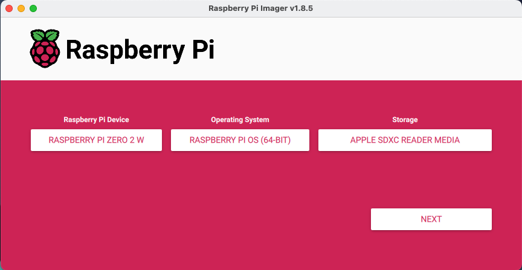
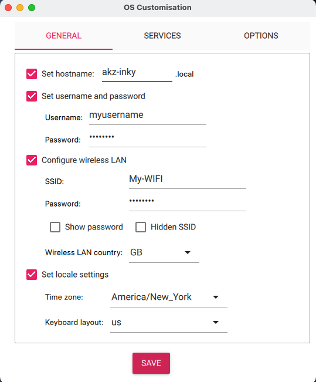
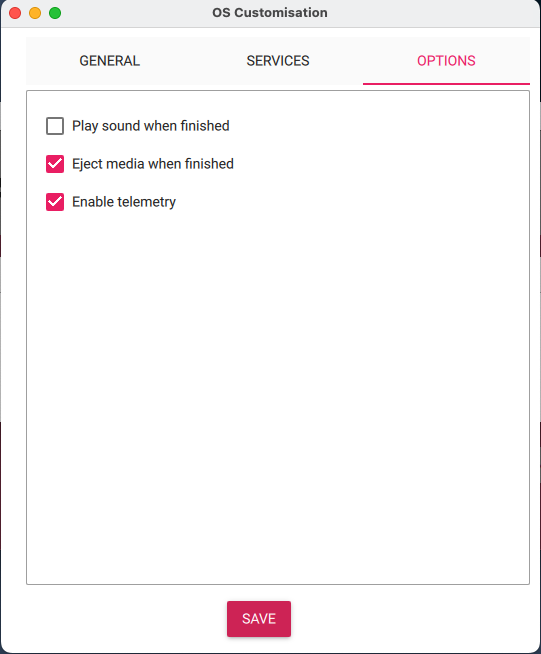
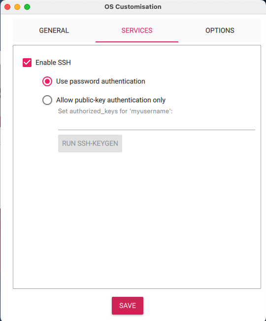

# InkyPiZero Detailed Installation

## Flashing Raspberry Pi OS 

1. Install the Raspberry Pi Imager from the [official download page](https://www.raspberrypi.com/software/)
2. Insert the target SD Card into your computer and launch the Raspberry Pi Imager software
    - Raspberry Pi Device: Choose your Pi model
    - Operating System: Select the recommended system
    - Storage: Select the target SD Card



3. Click Next and choose Edit Settings on the Use OS customization? screen
    - General:
        - Set hostname: enter your desired hostname
            -  This will be used to SSH into the device to install
               InkyPiZero (see below) - there's no web UI to reach until
               after that's done.
        - Set username & password
            - Do not use the default username and password on a Raspberry PI as this poses a security risk
        - Configure wireless LAN to your network
            - This is also the network you'll SSH in over, and that the
              always-on settings web UI will be reachable on once installed
              (see [Configuring your location and settings](#configuring-your-location-and-settings)
              below)
        - Set local settings to your Time zone
    - Service:
        - Enable SSH:
            - Use password authentication
    - Options: leave default values

<p float="left">
  
   
  
</p>

4. Click Yes to apply OS customization options and confirm

## Installing InkyPiZero

5. SSH into the Pi using the hostname/credentials set above:
    ```bash
    ssh <username>@<hostname>.local
    ```
6. Clone the repository and run the installer:
    ```bash
    git clone https://github.com/DorusvdLinden/InkyPiZero.git
    cd InkyPiZero
    sudo bash install/install.sh
    ```
    This creates its own Python virtual environment
    (`/usr/local/pi-weather-display/venv`), enables the SPI/I2C interfaces
    the Inky display needs, and installs several systemd units: a
    `pi-weather-display.timer` that renders and pushes to the display every
    10 minutes, a persistent `pi-weather-buttons.service` that listens for
    the four physical buttons on the back of the panel, and a persistent
    `pi-weather-web.service` serving the settings/WiFi-management web UI
    (`hostapd`/`pi-weather-ap-dnsmasq` are also installed but only run
    on-demand, when hosting a WiFi setup AP - see
    [networking.md](./networking.md)).
7. Reboot if the installer enabled SPI/I2C for the first time (only needed
   on a fresh install, not on reinstalls/updates).

## Configuring your location and settings

Once installed, set your location (`latitude`/`longitude`) and every other
preference from the always-on web UI at `http://<device IP>:8080/settings`
- reachable on the same WiFi network configured above. Alternatively, edit
`config.py` directly in the git checkout (before or after installing) for a
change that should apply with no web UI involved. See
[settings.md](./settings.md) for the full reference of every option and how
the physical buttons/web UI/`config.py`/CLI flags relate.

If the device can't reach a known WiFi network at all (e.g. you skipped
setting one up via Raspberry Pi Imager), it hosts its own setup AP instead
and shows the connect details directly on the e-paper display - see
[networking.md](./networking.md).

Changes take effect on the next render - no service restart needed, or
force one immediately:
```bash
sudo systemctl start pi-weather-display.service
```

## Verifying the install

```bash
systemctl status pi-weather-display.timer     # confirm the render timer is active
journalctl -u pi-weather-display.service      # view render logs
systemctl status pi-weather-buttons.service   # confirm the button listener is active
systemctl status pi-weather-web.service       # confirm the settings/WiFi web UI is active
```

If something looks wrong, see [troubleshooting.md](./troubleshooting.md).
